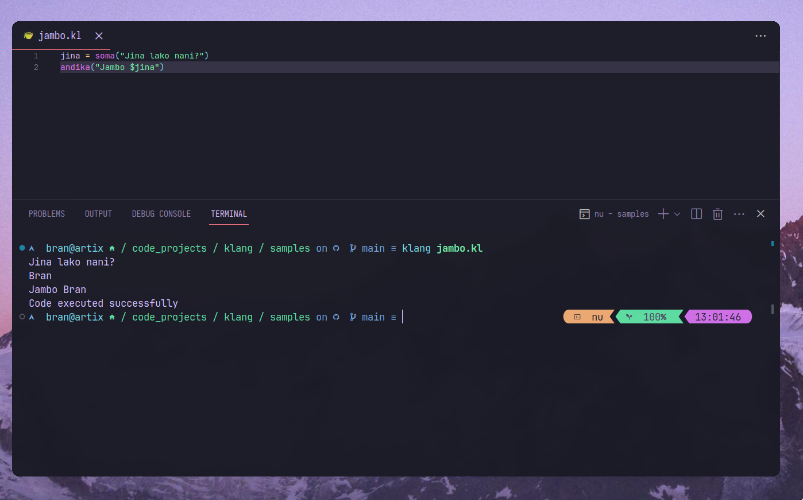
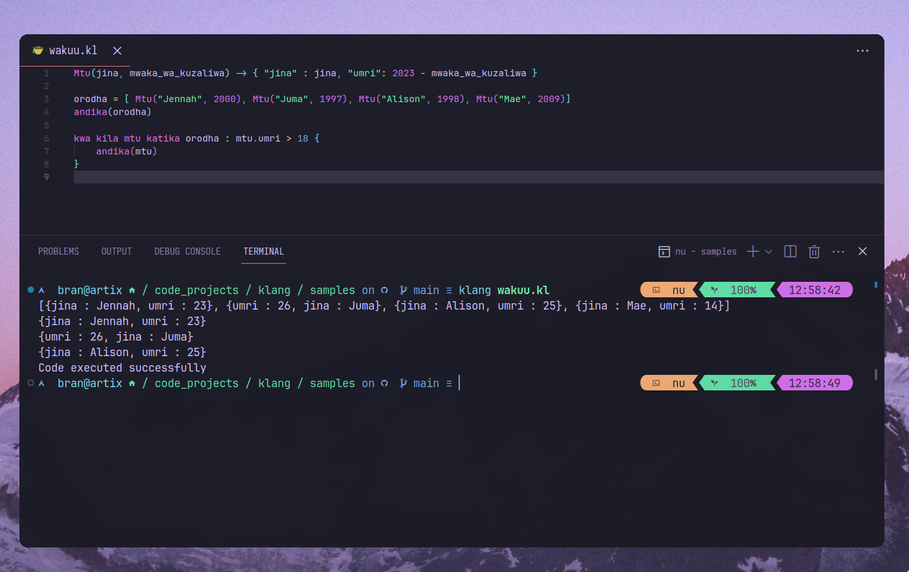
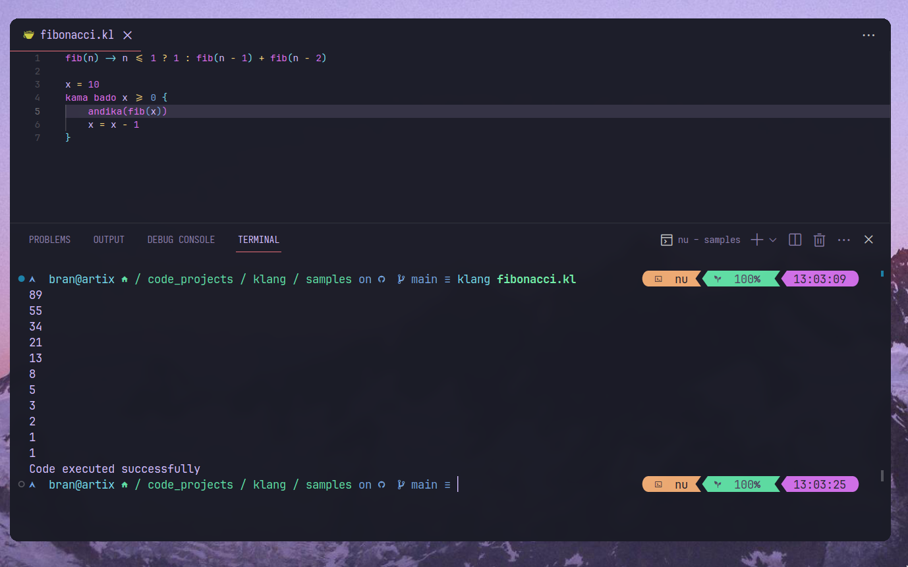

# Klang
A simple intepreter for a swahili based programming language.

## Setting up the intepreter
`cargo install --git https://github.com/Brannigan123/klang.git`

## Sample runs
### samples/jambo.kl

### samples/wakuu.kl

### samples/fibonacci.kl

